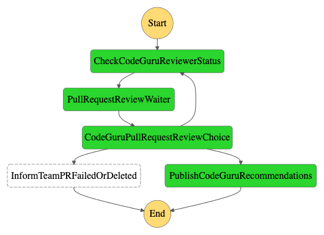

# Automate Code Challenge Reviews with Amazon CodeGuru Reviewer

In this project, I demonstrate how to automate code challenge reviews with Amazon CodeGuru Reviewer with
Amazon Step Functions, AWS Lambda, and AWS SAM.

### How it works

1. One a periodic schedule, an AWS Lambda function checks to see if there are pending pull request reviews in Amaon CodeGuru 
Reviewer.
2. Immediately it finds any, it automatically triggers an Amazon Step Function state machine which does the following:
    - Polls for the state of the code review 
    - Once the code review is completed, it immediate sends a notification via Amazon SNS Topic to the team email address
    provided. The email formats the recommendations from Amazon CodeGuru Reviewer. The notification can be integrated with
    Slack or any other work instant messaging service.
3. Team members can then go ahead to review the business logic implementation, leaving functional level coding issues to
Amazon CodeGuru Reviewer.

### AWS Step Functions State Machine Diagram

With this, it is possible to further extend this application to cover full repository reviews by Amazon CodeGuru Reviewer.

### Limitations
As of the time of this writing, Amazon CodeGuru Reviewer does not publish events to Amazon CloudWatch, this is the reason
for triggering the AWS Lambda function on schedule. The consequence of this is that, the trigger might miss some Amazon CodeGuru
Pull Request reviews that were completed without notifying the team. I would assume this is feature to expect from the Amazon
CodeGuru team.  

### Extensibility
This serverless application is largely extensible from polling for pull requests only to full repository scans. As already
mentioned, this can reduce the time spent by engineering teams in identifying functional level issues, while focusing
on debugging business logic
